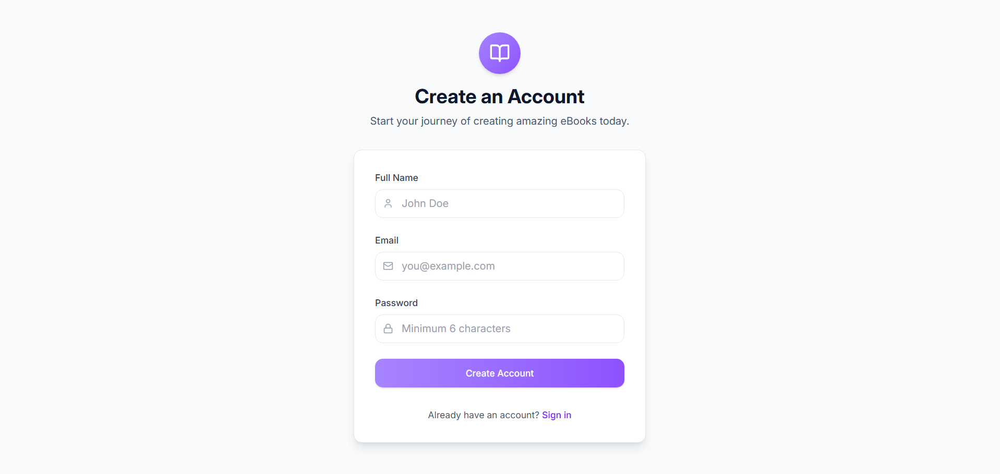
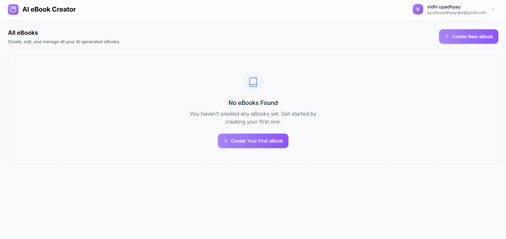
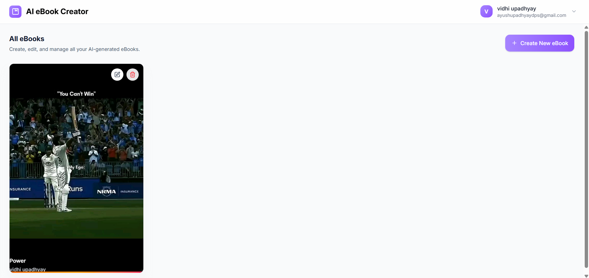
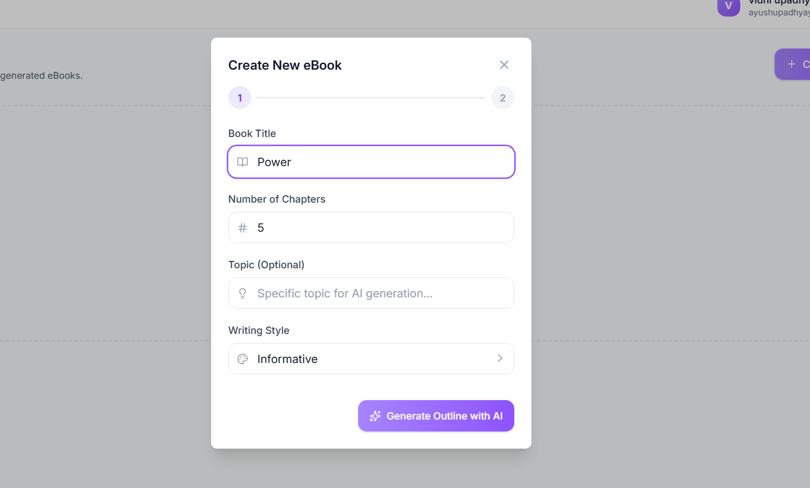
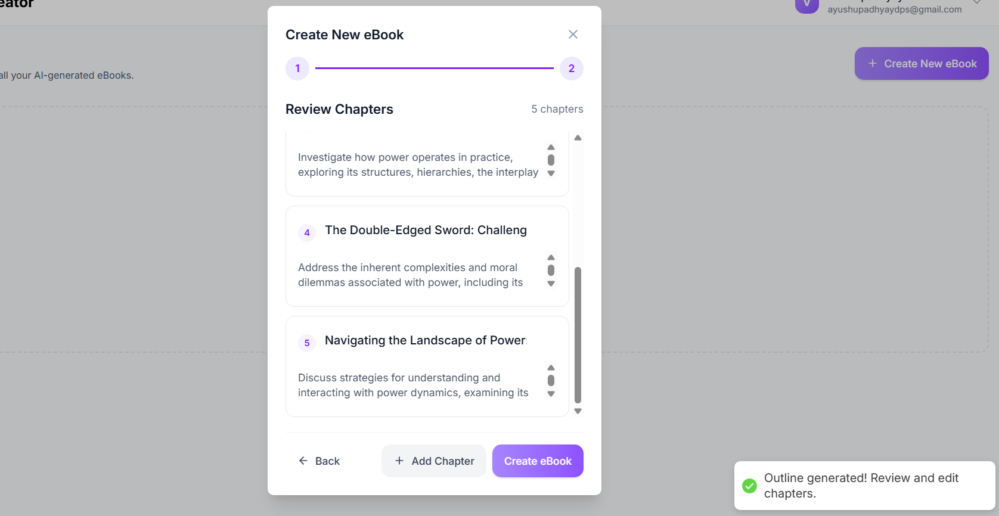
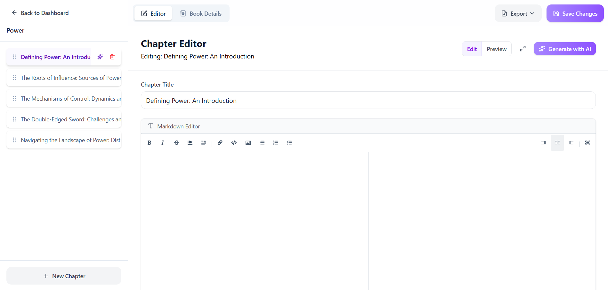
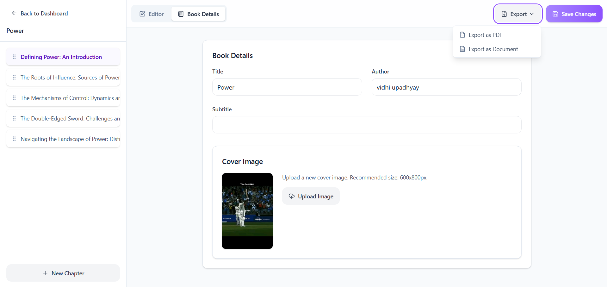
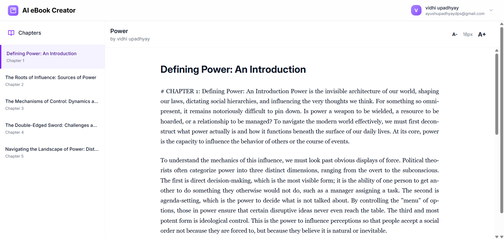
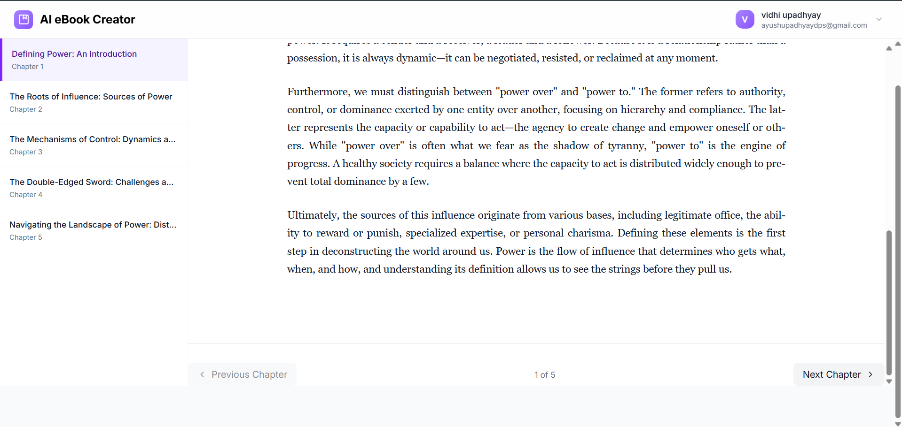

# AI eBook Generator

An AI-powered web application that allows users to generate complete eBooks with AI-generated chapters using the Google Gemini API.

## Features

- AI-based eBook outline generation
- AI-generated chapter content
- User authentication with JWT
- Create, edit and manage books
- Also option for Reading / Viewing eBook chapters
- Drag-and-drop chapter reordering
- Upload custom cover images
- Export books as PDF or document
- Responsive UI

## Tech Stack
Frontend
- React
- Tailwind CSS
- Axios
Backend
- Node.js
- Express.js
- MongoDB
- Mongoose
- Multer (file upload)
- JWT Authentication
AI Integration
- Google Gemini API

## Screenshots ->
### HomePage

### Features section

### SignUp

### Login

### Dashboard

### Create New Book

### Editor Page

### Book details tab

### View Book

### Backend setup
cd backend
npm install
npm start

### Frontend setup
cd frontend/eBookCreater
npm install
npm run dev

## Future Improvements
- Deploy application to cloud
- Add collaborative editing
- Improve AI prompt optimization

